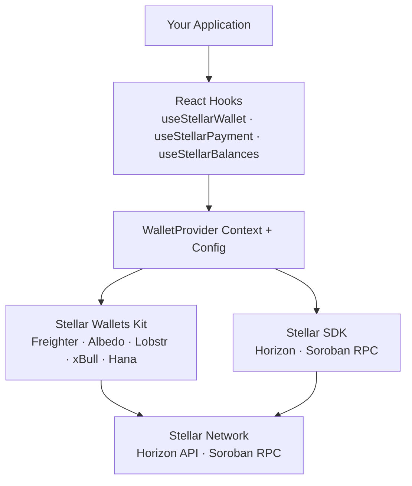

# Nextellar SDK Overview

The **Nextellar SDK** is a set of React hooks, utilities, and typed APIs that make interacting with the Stellar network simple, reliable, and composable within Next.js applications. Built on top of `@stellar/stellar-sdk` and `@creit.tech/stellar-wallets-kit`, the SDK provides production-ready abstractions for wallet connection, payments, smart contracts, and more.

---

## Core Components

### React Hooks

8 production-ready hooks for common Stellar operations:

| Hook                                                           | Purpose                                     |
| -------------------------------------------------------------- | ------------------------------------------- |
| [`useStellarWallet`](/docs/hooks/use-stellar-wallet)           | Wallet connection and account management    |
| [`useStellarBalances`](/docs/hooks/use-stellar-balances)       | Real-time balance tracking with polling     |
| [`useStellarPayment`](/docs/hooks/use-stellar-payment)         | Payment transaction building and submission |
| [`useTrustlines`](/docs/hooks/use-trustlines)                  | Asset trustline management                  |
| [`useTransactionHistory`](/docs/hooks/use-transaction-history) | Paginated transaction history               |
| [`useSorobanContract`](/docs/hooks/use-soroban-contract)       | Smart contract interaction                  |
| [`useSorobanEvents`](/docs/hooks/use-soroban-events)           | Contract event listening                    |
| [`useOfferBook`](/docs/hooks/use-offer-book)                   | DEX orderbook queries                       |

### Context Providers

- **WalletProvider** - Global wallet state management
- **useWallet** - Access wallet state from any component
- **useWalletConfig** - Access provider configuration in standalone hooks

### UI Components

- **WalletConnectButton** - Pre-built wallet connection button with dropdown

### Utility Layer

- **stellar-wallet-kit.ts** - Wallet adapter configuration
- Automatic XDR building and signing
- Network configuration helpers

---

## Architecture



---

## Key Features

### Auto-Consume Pattern

All hooks automatically consume configuration from `WalletProvider`:

```tsx
<WalletProvider horizonUrl="https://horizon.stellar.org">
  <App /> {/* All hooks use mainnet automatically */}
</WalletProvider>
```

### XDR Building Pattern

Hooks provide methods to build unsigned XDR for external wallet signing:

```tsx
// Build unsigned transaction
const xdr = await buildPaymentXDR({ from, to, amount });

// Sign with wallet
const signedXdr = await wallet.signTransaction(xdr);

// Submit to network
const result = await submitSignedXDR(signedXdr);
```

### Type Safety

Full TypeScript support with comprehensive type definitions:

```typescript
interface Balance {
  asset_type: string;
  asset_code?: string;
  asset_issuer?: string;
  balance: string;
  limit?: string;
}
```

### Error Handling

Consistent loading/error states across all hooks:

```tsx
const { data, loading, error, refresh } = useSomeHook();

if (loading) return <Spinner />;
if (error) return <button onClick={refresh}>Retry</button>;
```

---

## Dependencies

The SDK is built on:

| Package                           | Version | Purpose                     |
| --------------------------------- | ------- | --------------------------- |
| `@stellar/stellar-sdk`            | ^14.0.0 | Horizon/Soroban interaction |
| `@creit.tech/stellar-wallets-kit` | ^1.8.0  | Multi-wallet support        |
| `react`                           | ^19.0.0 | React hooks                 |
| `next`                            | ^16.0.0 | App framework               |

---

## Security

- **Never expose private keys** - Wallet adapters handle signing securely
- **Dev-only methods** - `*WithSecret()` functions are clearly marked for testing only
- **Input validation** - All hooks validate addresses, amounts, and memos
- **Rate limiting** - Consider implementing rate limits for Horizon requests

---

## Quick Start

1. **Scaffold a project**

   ```bash
   npx nextellar my-app
   ```

2. **Wrap with WalletProvider**

   ```tsx
   <WalletProvider>
     <App />
   </WalletProvider>
   ```

3. **Use hooks**
   ```tsx
   const { connect, publicKey } = useWallet();
   const { balances } = useStellarBalances(publicKey);
   ```

---

## Related Documentation

- [Hooks Reference](/docs/hooks) - All 8 hooks with examples
- [API Reference](/docs/sdk/api-reference) - Type definitions and utilities
- [Wallet Integration](/docs/sdk/wallet-integration) - Multi-wallet setup
- [CLI Reference](/docs/cli/commands) - Scaffolding options
